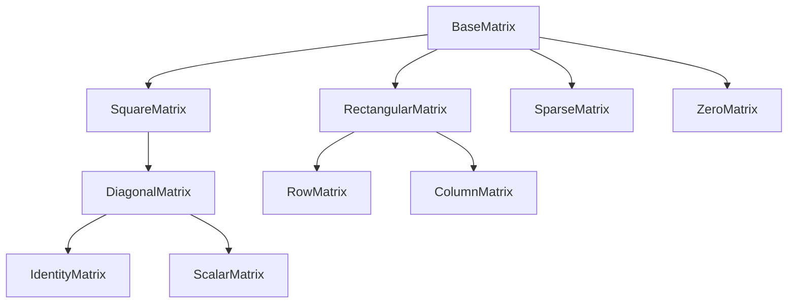

# LinearAlgebra

This repository is a work in progress. It will contain a set of algorithms for solving some problems in Linear Algebra.

Matrix Decomposition:

- [ ] Singular Value Decomposition
- [x] QR Factorization
- [x] LU Factorization
- [ ] Eigenvalue Decomposition

Matrix Operations:

- [x] Matrix-Matrix operations
- [x] Matrix-Vector operations
- [ ] Matrix-Scalar operations

Algorithms for checking Matrix Properties

- [ ] Determine Invertible Matrix
- [ ] Determine Square Matrix
- [x] Determine Upper Triangular Matrix
- [x] Determine Lower Triangular Matrix
- [x] Find Determinant of Matrix
- [x] Find Transpose of Matrix
- [ ] Find Inverse of Matrix
- [x] Find Trace of Matrix

Matrix Object Hierarchy

